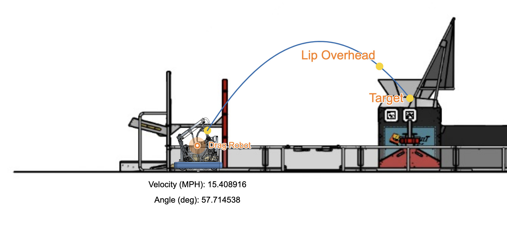

# 3648 Skeleton Repository
This is our team's template repository for future First Robotics Competitions. It contains most of the basics for our swerve drive bots, including AprilTag localization, Swerve, LEDs, Vision, and networking.

### Trajectory Calculations - Desmos
Math used to find an initial velocity $v_0$ and angle $\theta$ to land within the Hub. Click the Image for more details. 

