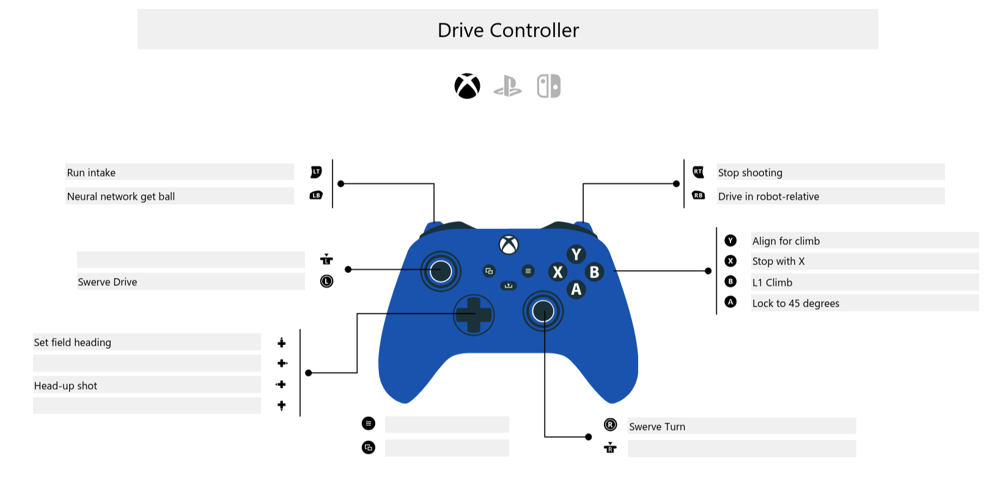
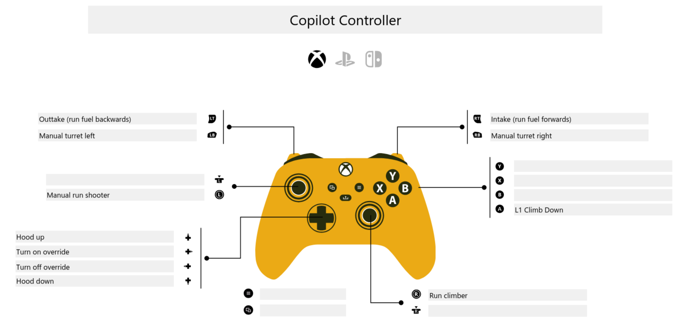

# Team 3468 2026 Rebuilt
This is our team's repository for the 2026 FRC Rebuilt competition.

## Resources

### Control Schemes



### Troubleshooting Guide
A troubleshooting guide for LED statuses can be found at [Troubleshooting Guide](src/main/resources/statusableList/TROUBLESHOOTING.md).

### Trajectory Calculations - Desmos
Math used to find an initial velocity $v_0$ and angle $\theta$ to land within the Hub. Click the image to access tool. 
[](https://www.desmos.com/calculator/2vgcp7eqsk)

## Style Guide
Unless otherwise specified, like in naming, this repository should follow [Google's Java style guide.](https://google.github.io/styleguide/javaguide.html) Our formatter should automatically enforce this.

## Naming Conventions
### Logging
Logging should be as broken down as possible and as frequent as possible. Every variable should be readable.

* Subsystems should be under the banner _Subsystems_.
* Commands under the _Commands_.
* Debug information under _Debug_.
* Utils under _Utils_.

The folder should in turn be followed by the class name, followed by the method (for particularly complcated systems), followed by the variable logged.  
__E.g. to log `Drive.getPose()`:__

```java
Logger.recordOutput("Subsystems/Drive/Pose", Drive.getPose());
```

### Variable Naming
All varable names should be in `camelCase`. \
Constants should have the prefix "_k_", with this counting as a new 'word' for camel case. Instance variables are given the prefix "*m_*", which should **not** count as a new 'word' for camel case.

__Example Constants:__
```java
public static final double kOdometryFrequency = 100.0;
public static final double kTrackWidth = Units.inchesToMeters(24.8);
```

__Example Instance Variables__
```java
private boolean m_firstTimeSlot;
private boolean m_onShift;
private double m_timeLeft;
private double m_timeUntil;
private double m_time;

public ShiftTracker() {
  m_firstTimeSlot = false;
  onShift = false;
  m_time = 0.0;
}
```

## Final Bot Checklist
### Analog Test Everything (30 mins).

- [ ] Drive
  - Zero swerve if needed

Drive Left X,Y Axis
Drive Y Axis
[ ] Intake
Controller two.LeftY
[ ] Climb
Copilot, left y
[ ] Hopper
Test three controller left Trigger
[ ] Shooter
Test3 controller, right y. 
[ ] Kicker
Test three controller right trigger
[ ] Turret
Test 3 controller, left y.
[ ] Pneumatics
Test 3 Controller POV Up and Down

Tune Camera (30 mins)
Offsets
Limelight-foura.local:5801 – 10.36.48.67
Limelight-fourb.local:5801 – 10.36.48.68
Limelight-fourc.local:5801 – 10.36.48.69
Limelight-three.local:5801 – 10.36.48.70
/AdvantageKit/RealOutputs/Subsystems/Vision


Tune Turret Encoder Factor (10 min)
/AdvantageKit/RealOutputs/Subsystems/Turret/MotorIO/getPosition
Test 3 controller, left y.


Get Climb constants. (30 min)
Low climb pose
High generic pose
P
Extended pose.
Copilot, left y
/AdvantageKit/RealOutputs/Subsystems/Claw/MotorIO/getPosition

FF Characterize shooter, tune. (15 min)
Run Auto: Shooter simple FF identification
Read console: FF
/AdvantageKit/RealOutputs/Utils/FFCharacterizer/kSResult
/AdvantageKit/RealOutputs/Utils/FFCharacterizer/kVResult
kV
kS
Test:
m_testController.x, sets speed to 
/SmartDashboard/TunableNumbers/Test/Subsystems/Shooter/testShootRPM
Option 1: Dumb matrix
Get Matrix values (angle, speed, hangtime) (30 min)
Shoot .5m-8m.

Test Intake
- Solenoids + Rollers
- m_driveController.y
Neural Network
Drive while running intake. 
m_driveController.leftBumper()
Option 2: Smart Shooter Angle
Get shooter angle (low speed) (15 min)
Get basic velocity factor (20 min)
Shoto 1 m
Shoot 2 m
Shoot 3 m
Shoot 4 m
Get Matrix values (velocity) (30 min)
Shoot .5m-8m.


Extra
FF drive characterization. (10 min)
Auto: Drive Simple FF Identification
